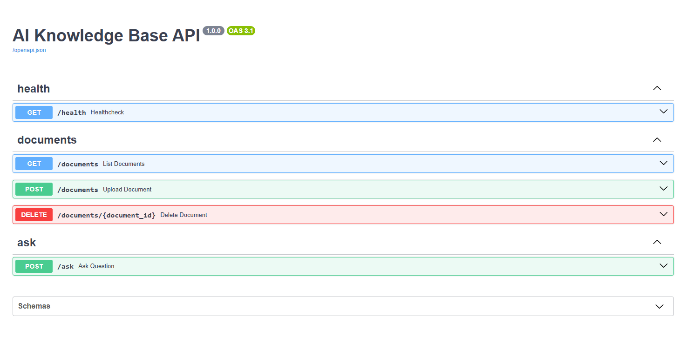

# AI Knowledge Base API


# AI Knowledge Base API

Backend service for uploading documents, indexing them with AI, storing embeddings in a vector database, and answering questions based on the uploaded content.

## Features

- Upload documents in **TXT**, **PDF**, and **MD** formats.
- Save document metadata in **PostgreSQL**.
- Process uploaded documents asynchronously with **Celery**.
- Split text into chunks with **LangChain**.
- Generate embeddings and store them in **pgvector** inside PostgreSQL.
- Ask questions across one or more processed documents.
- Retrieve the most relevant chunks via similarity search.
- Generate answers through **LangChain** + an LLM provider.
- Structured JSON logging for API startup, document lifecycle, Celery tasks, AI requests, and errors.

## Technology Stack

- **FastAPI** — REST API.
- **LangChain** — document loaders, text splitting, embeddings, retrieval, LLM interaction.
- **PostgreSQL** — document metadata storage.
- **pgvector** — vector storage and similarity search.
- **Celery** — background document indexing and summary generation.
- **Redis** — broker for Celery.
- **SQLAlchemy** — async ORM/database access.
- **Structlog** — structured logging.
- **Docker / Docker Compose** — local environment orchestration.

## Project Architecture

```text
Client
  |
  v
FastAPI API
  |-- POST /documents ------> PostgreSQL (document metadata)
  |                            \
  |                             --> Celery task queue (Redis)
  |
  |-- GET /documents --------> PostgreSQL
  |
  |-- DELETE /documents/{id} -> PostgreSQL + pgvector cleanup
  |
  |-- POST /ask -------------> embed question -> similarity search in pgvector
                                   |
                                   v
                             top-k chunks -> LangChain prompt -> LLM -> answer

Celery worker
  |
  -> load file from storage
  -> split text into chunks
  -> generate embeddings
  -> store vectors in pgvector
  -> update document status in PostgreSQL
  -> optionally generate summary
```

## How the System Works

### 1. Document upload

`POST /documents` accepts a file (`txt`, `pdf`, `md`). After upload the system:

1. saves the file to local storage;
2. creates a document record in PostgreSQL with status `processing`;
3. sends a `process_document` task to Celery.

### 2. Background processing

The Celery worker:

1. loads the file with a LangChain loader;
2. splits text into chunks with `RecursiveCharacterTextSplitter`;
3. generates embeddings;
4. stores chunk vectors in `pgvector`;
5. updates the document status to `processed` or `failed`;
6. generates a short summary for cataloging.

### 3. Question answering

`POST /ask`:

1. creates an embedding for the user question;
2. performs similarity search over chunk embeddings for selected documents;
3. selects top-k relevant chunks;
4. builds a LangChain prompt from the retrieved context;
5. calls the LLM and returns the answer with sources.

## Services Started by Docker Compose

`docker-compose.yml` starts the following containers:

- **api** — FastAPI application.
- **celery** — Celery worker.
- **db** — PostgreSQL with `pgvector` support.
- **redis** — Celery broker.

## Getting Started

### Prerequisites

Before starting, make sure you have installed:

- Docker
- Docker Compose

### 1. Create `.env`

Create a `.env` file in the project root.

Example:

```env
PROJECT_NAME=AI Knowledge Base API
PROJECT_VERSION=1.0.0
API_PREFIX=

POSTGRES_DB=ai_knowledge_base
POSTGRES_USER=postgres
POSTGRES_PASSWORD=postgres
POSTGRES_HOST=db
POSTGRES_PORT=5432

APP_HOST=0.0.0.0
APP_PORT=8000

REDIS_HOST=redis
REDIS_PORT=6379
REDIS_DB=0

OPENAI_API_KEY=
GROQ_API_KEY=
EMBEDDING_PROVIDER=fake
LLM_PROVIDER=fake
EMBEDDING_MODEL=text-embedding-3-small
LLM_MODEL=gpt-4o-mini
VECTOR_DIMENSIONS=1536

UPLOAD_DIR=storage/documents
CHUNK_SIZE=1000
CHUNK_OVERLAP=200
TOP_K=4
LOG_LEVEL=INFO
```

### 2. Build and start containers

```bash
docker compose up --build
```

### 3. Open the API

- API base URL: `http://127.0.0.1:8000`
- Swagger UI: `http://127.0.0.1:8000/docs`
- ReDoc: `http://127.0.0.1:8000/redoc`
- Health check: `http://127.0.0.1:8000/health`

## Running Notes

- By default the project can run in **demo mode** using:
  - `EMBEDDING_PROVIDER=fake`
  - `LLM_PROVIDER=fake`
- In demo mode embeddings and answers are mocked locally, which is convenient for development and testing without external AI calls.
- To use real OpenAI models, set:
  - `OPENAI_API_KEY=...`
  - `EMBEDDING_PROVIDER=openai`
  - `LLM_PROVIDER=openai`
- To use a free-tier setup without OpenAI billing, you can mix providers:
  - `LLM_PROVIDER=groq` with `GROQ_API_KEY=...` and e.g. `LLM_MODEL=llama-3.1-8b-instant`
  - `EMBEDDING_PROVIDER=huggingface` with e.g. `EMBEDDING_MODEL=sentence-transformers/all-MiniLM-L6-v2`
  - for `all-MiniLM-L6-v2`, set `VECTOR_DIMENSIONS=384`

## API Examples

Below are examples for the implemented endpoints.

### Health check

```bash
curl http://localhost:8000/health
```

Response:

```json
{
  "status": "ok"
}
```

### 1. Upload a document

```bash
curl -X POST http://localhost:8000/documents \
  -F "file=@./python.pdf"
```

Example response:

```json
{
  "document_id": "9e1c7a75-f46f-49c8-a9c6-3ccf6c46ad7b",
  "status": "processing"
}
```

### 2. Get document list

```bash
curl http://localhost:8000/documents
```

Example response:

```json
[
  {
    "id": "9e1c7a75-f46f-49c8-a9c6-3ccf6c46ad7b",
    "name": "python.pdf",
    "status": "processed",
    "chunks": 45,
    "created_at": "2026-03-21T10:15:30.000000Z"
  }
]
```

### 3. Delete a document

```bash
curl -X DELETE http://localhost:8000/documents/9e1c7a75-f46f-49c8-a9c6-3ccf6c46ad7b
```

Expected response: `204 No Content`

### 4. Ask a question

```bash
curl -X POST http://localhost:8000/ask \
  -H "Content-Type: application/json" \
  -d '{
    "question": "What is dependency injection?",
    "document_ids": ["9e1c7a75-f46f-49c8-a9c6-3ccf6c46ad7b"]
  }'
```

Example response:

```json
{
  "answer": "Dependency injection is a pattern where dependencies are provided to an object from the outside instead of being created inside it.",
  "sources": [
    {
      "document": "python.pdf",
      "chunk_id": 10
    },
    {
      "document": "python.pdf",
      "chunk_id": 11
    }
  ]
}
```



## Document Statuses

A document can be in one of these states:

- `processing` — uploaded and waiting for background indexing.
- `processed` — indexed successfully and available for QA.
- `failed` — processing failed; the error is stored in metadata.

## Logging

The project uses structured logging and records important events such as:

- server startup;
- document creation;
- Celery task start;
- AI question answering;
- processing failures and other errors.

## Example Request Flow

### Upload flow

1. Client sends `POST /documents`.
2. API stores file metadata in PostgreSQL.
3. API enqueues a Celery task.
4. Worker processes the document.
5. Embeddings are stored in pgvector.
6. Document status becomes `processed`.

### Ask flow

1. Client sends `POST /ask` with `document_ids`.
2. API builds an embedding for the question.
3. System finds similar chunks in pgvector.
4. LangChain builds a prompt from the retrieved chunks.
5. LLM returns an answer.
6. API returns answer + sources.

## Implementation Notes

- The vector database in this project is **pgvector**, running inside PostgreSQL.
- Uploaded files are stored locally in `storage/documents`.
- The API currently exposes these endpoints:
  - `GET /health`
  - `POST /documents`
  - `GET /documents`
  - `DELETE /documents/{document_id}`
  - `POST /ask`

## Quick Demo Scenario

```bash
# 1. Start the project
docker compose up --build

# 2. Upload a document
curl -X POST http://localhost:8000/documents -F "file=@./your-file.md"

# 3. Wait until status becomes processed
curl http://localhost:8000/documents

# 4. Ask a question using the returned document_id
curl -X POST http://localhost:8000/ask \
  -H "Content-Type: application/json" \
  -d '{"question":"What is the main idea of the document?","document_ids":["YOUR_DOCUMENT_ID"]}'
```

## Future Improvements

- Add authentication/authorization.
- Add object storage support (S3/MinIO).
- Add retry/dead-letter strategy for failed background tasks.
- Add filtering, pagination, and document summaries to list endpoints.
- Add automated tests and CI pipeline.
